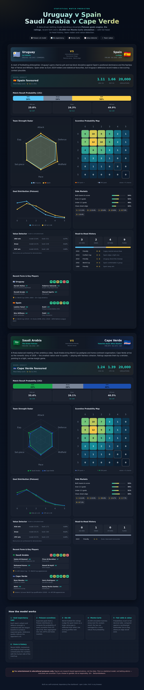

# ⚽ Statistical Match Predictor

A self-contained, dependency-free sports-betting model and visual dashboard for:

- 🇺🇾 **Uruguay vs Spain** 🇪🇸
- 🇸🇦 **Saudi Arabia vs Cape Verde** 🇨🇻

Just open **`index.html`** in any browser — no build step, no internet, no libraries.



## What it does

For each fixture the model produces:

| Output | Method |
| --- | --- |
| **Expected goals (xG)** | Attack/defence strength × league baseline |
| **1X2 win/draw/win probabilities** | Bivariate Poisson + Elo tilt + form |
| **Scoreline probability map** | Full 0-0 → 8-8 Poisson matrix (heatmap) |
| **Most likely scorelines** | Top-6 from the matrix |
| **Side markets** | BTTS, Over/Under 2.5, clean-sheet edge |
| **Fair odds & value detector** | Probabilities → decimal odds vs a book line |
| **Confidence check** | 20,000-run Monte-Carlo simulation |
| **Context** | Team radars, recent form, key players, head-to-head history |

## How the model works

1. **Goal expectancy** — each side's attack and defence ratings combine with the
   league-average goals baseline to produce expected goals; strong defences
   suppress the opponent's xG.
2. **Poisson scorelines** — the xG values drive a Poisson distribution to give
   the probability of every scoreline, aggregated into match markets.
3. **Elo tilt** — World-Football Elo ratings nudge the goal means so a large
   rating gap is reflected even when raw scoring profiles look alike.
4. **Form momentum** — recent W/D/L results apply a small multiplier.
5. **Monte-Carlo** — 20,000 simulated matches stress-test the analytic result;
   the two are averaged for a more robust final probability.
6. **Fair odds & value** — probabilities invert to fair decimal odds and are
   compared against a synthesised bookmaker price to flag where an edge exists.

## Project structure

```
index.html        # page shell + methodology
css/styles.css    # dark glassy dashboard theme
js/data.js        # team stats, ratings & head-to-head history
js/model.js       # Poisson + Elo + Monte-Carlo prediction engine
js/charts.js      # hand-rendered SVG charts (heatmap, radar, curves)
js/app.js         # builds the UI from model output
```

## Disclaimer

⚠️ **For entertainment and educational purposes only.** All figures are
research-based approximations, not live data feeds. This is a statistical model,
not betting advice — sporting outcomes are inherently uncertain. If you choose to
gamble, do so responsibly. **18+ · BeGambleAware.org**
