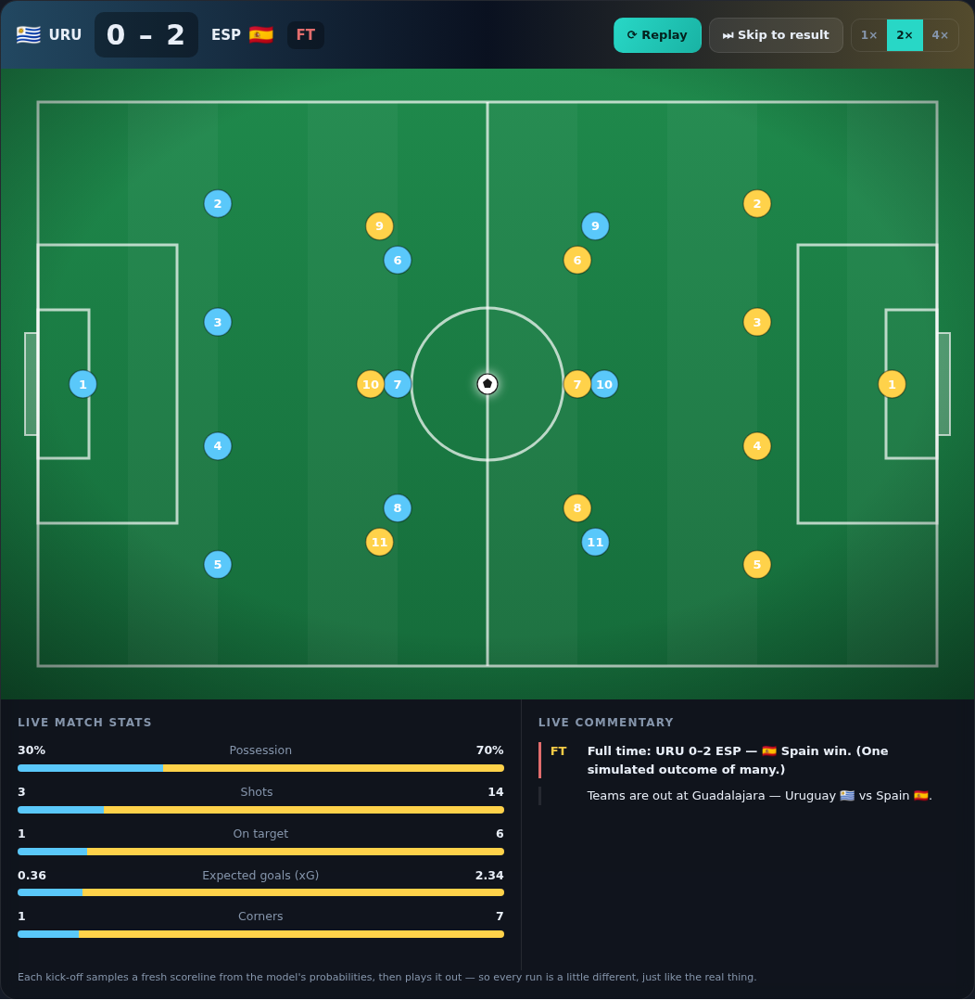

# ⚽ World Cup 2026 · Group H — Predictor & Live Match Simulator

A **single, self-contained HTML file** — no libraries, no build step, no internet.
Just **double-click `index.html`** and it runs in any browser.

It models the two simultaneous, decisive **Group H Matchday-3** fixtures of the
2026 FIFA World Cup (26 June 2026):

- 🇺🇾 **Uruguay vs Spain** 🇪🇸 — Estadio Akron, Guadalajara
- 🇨🇻 **Cape Verde vs Saudi Arabia** 🇸🇦 — NRG Stadium, Houston


## ⭐ The headline feature: a live match simulator

Each match has an animated, top-down **pitch** where the game plays out
minute-by-minute, driven by the model:

- ▶ **Kick off** samples a fresh scoreline from the model's probabilities and
  plays it out live, with **1× / 2× / 4×** speed and **⏭ Skip to result**
- Live **scoreboard + clock**, moving **ball** and both teams in **4-3-3**
- **Goal celebrations** — screen flash, "GOAL!" burst and confetti
- Live **stats** (possession, shots, on-target, xG, corners) that build in real time
- A scrolling **commentary feed** using real squad names



## Built on real data (June 2026)

| Team | FIFA rank | Elo | Group H |
| --- | --- | --- | --- |
| 🇪🇸 Spain | 3 | 2129 | 4 pts — beat Saudi 4-0, drew Cape Verde 0-0 |
| 🇺🇾 Uruguay | 17 | 1890 | 2 pts — drew Saudi 1-1, drew Cape Verde 2-2 |
| 🇨🇻 Cape Verde | 63 | 1625 | 2 pts — unbeaten, drew Spain & Uruguay |
| 🇸🇦 Saudi Arabia | 59 | 1593 | 1 pt — must win |

The model is **calibrated to the real market**: it reproduces the Opta
supercomputer's Uruguay v Spain line (≈ Spain 67% / draw 21% / Uruguay 12%,
vs Opta's 62 / 22 / 16) and the genuine coin-flip with a slight Cape Verde
lean for the second game.

## What each match shows

- **Model verdict** + expected goals (xG) + most-likely scoreline
- **1X2 probabilities** and fair decimal odds
- **Scoreline probability heatmap** (every score 0-0 → 8-8)
- **Team-strength radar**, **Poisson goal-distribution curves**
- **Side markets** (BTTS, Over/Under 2.5) and a **value detector**
- **Head-to-head history** and current **form / key players**

Plus a **Group H standings** table with qualification scenarios.

## How the model works

1. **Goal expectancy** — real attack/defence strengths × tournament baseline → xG
2. **Poisson scorelines** — xG → probability of every scoreline → 1X2/BTTS/totals
3. **Elo tilt** — World-Football Elo nudges the goal means toward the stronger side
4. **Monte-Carlo** — 20,000 simulated matches; analytic + simulated are averaged
5. **Fair odds & value** — probabilities invert to odds, compared to a book line
6. **Match simulator** — replays a sampled scoreline as a live, animated game

## Files

```
index.html        # everything — markup, styles, data, model, charts, simulator
docs/             # preview screenshots
```

## Disclaimer

⚠️ **For entertainment and educational purposes only.** Figures are
real-world-based estimates compiled for modelling, not a live feed, and the
simulator is a probabilistic illustration — not a guaranteed outcome. This is a
statistical model, not betting advice. If you choose to gamble, do so
responsibly. **18+ · BeGambleAware.org**
